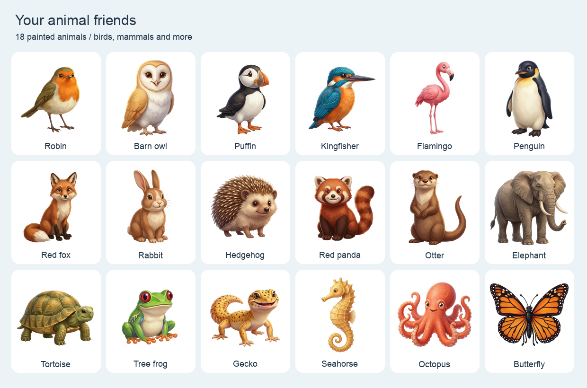
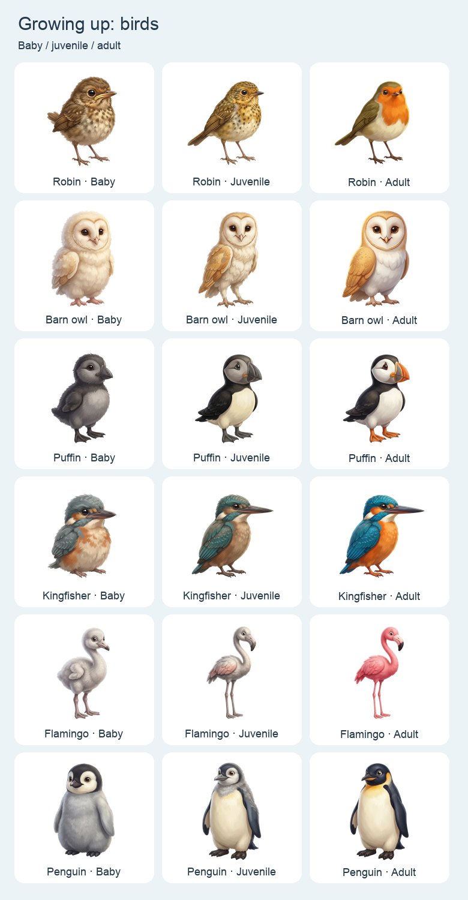
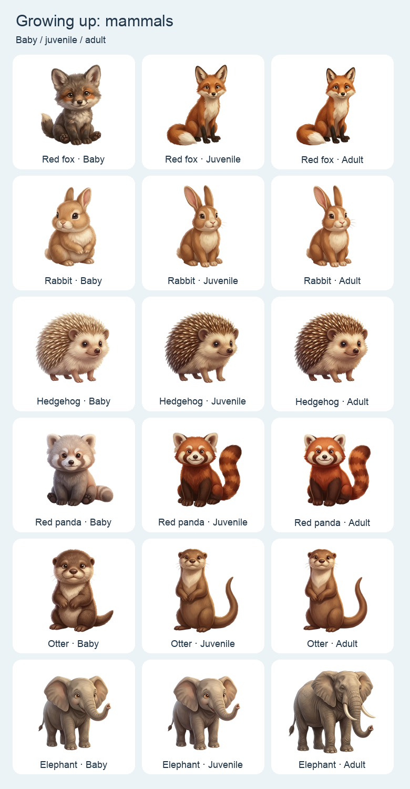
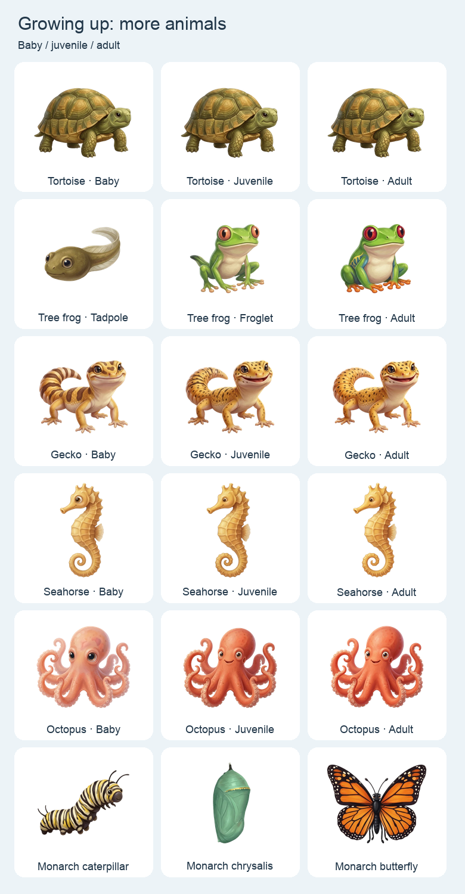

# Animal friends

Animal mode has 18 species and 54 individually generated illustrations: baby,
juvenile and adult forms of six birds, six mammals and six other animals.
Google Nano Banana 2 (`gemini-3.1-flash-image`) generated each one separately on 26 September 2026. The initial animal illustrations used
the existing Pikachu as a reference for painted texture, lighting and shape.
Each younger form then used its own species illustration as its reference,
with distinct age-related proportions and markings. The initial young elephant
became the juvenile, and a new calf and mature adult complete its sequence.



The exact individual requests are saved in [animal-art-prompts.json](animal-art-prompts.json).
The [generation record](animal-art-generation.json) records the provider and the
clownfish request that Google rejected twice; a seahorse fills that catalogue
position. Each accepted original also has a local JSON record beside it with
its actual prompt, settings and generation time.

## Progress and space

Every animal starts as a baby costing 20 coins. Each completed lesson advances
all collected animals by one stage: Baby → Juvenile → Adult. Every stage has a
separate illustration, with visible changes in proportions, fur, feathers and
markings. Younger animals also appear smaller in the collection. Adults stay adults, and progress never decays for missed days.
Frogs follow Tadpole → Froglet → Adult; monarch butterflies follow Caterpillar
→ Chrysalis → Adult. Stage names remain live text, rather than generated lettering.
The shop offers All animals, Birds, Mammals and More animals.





Garden, Pokémon and Animals have 18 starting spaces. Filling the last space adds
another row of six automatically, with no upper purchase cap. Duplicate animals
are allowed. The collection badge remains a fixed milestone at 18, independent
of the number of visible spaces. Existing badges and saved collections survive.
Football now has 18 unique players; see [football artwork](football-art.md).

## Recreate the artwork

Use the ignored `.env.local` file described in [Nano Banana setup](nano-banana-2.md).
The key is used only by the local generator, never bundled into the app.

```sh
npm run art:animals -- --dry-run
npm run art:animals -- --only robin-baby,robin-juvenile
npm run art:animals
```

Requests run one at a time and use the existing Google API integration. Existing
originals are skipped, and an error stops the batch. No retries happen
automatically. Each prompt records its reference: the original Pikachu for the
first animal illustrations, or that species’ illustration for a new growth stage.
White-background originals and their records are kept in the ignored
`output/nano-banana-2/animals/originals/` folder.

After reviewing the originals, use the local background-removal environment
from [background removal](background-removal.md):

```sh
output/nano-banana-2/.venv-rembg/bin/python scripts/prepare-pokemon.py --theme animals
output/nano-banana-2/.venv-rembg/bin/python scripts/preview-pokemon.py --theme animals
```

The shared preparation script defaults to Pokémon when `--theme` is omitted.
For animals it caches full-size transparent cutouts in
`output/nano-banana-2/animals/cutouts/`. BiRefNet-General-Lite removes the white
background, with colour decontamination to reduce edge fringes. The processor
disables ONNX allocation caches to avoid retaining large amounts of memory
during long batches. The output is
512 × 512 transparent WebP at quality 88, encoder method 4, under
`public/art/rewards/animals/`. All images load locally with no API calls at runtime.

The preview command makes the adult overview and three growth-stage sheets,
plus dark versions in `output/nano-banana-2/animals/` for checking fine edges.
Use `--available` with the preparation command to process completed originals
while other images are still generating.
To regenerate an existing animal, first move its original and cached cutout
aside; both generation and preparation intentionally reuse existing results.

## Validation

The production build, 170 unit tests, 12 browser tests and 9 generator checks
pass. All 54 growth images render in the app, including on a 375px screen, with
no missing images or horizontal overflow. Every asset is a transparent 512px
WebP with its full silhouette inside the frame. The animal set totals 1.67 MB.
