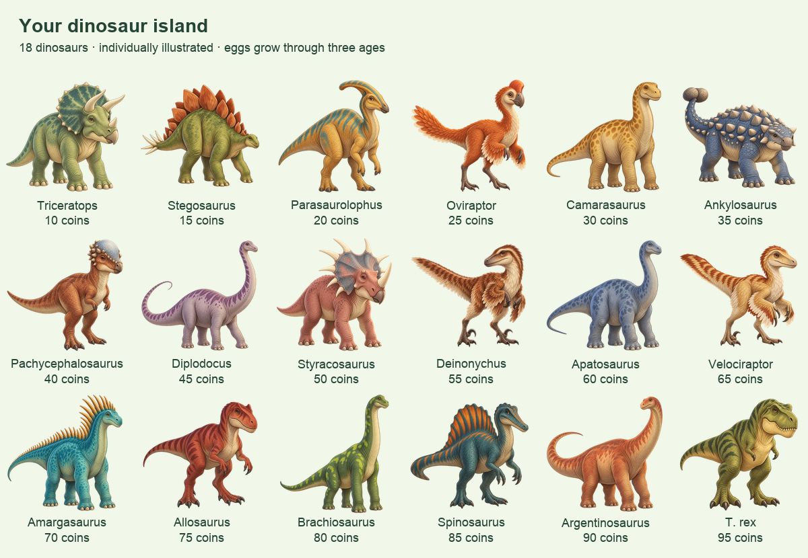

# Dinosaur island

Dinosaurs is the fifth reward mode. It follows the animal collection's layout,
group filters and lesson-based growth. There are 18 kinds with distinct prices
from 10 to 95 coins, shown cheapest first. Collections start at 18 spaces and
add six whenever full. Duplicate dinosaurs are welcome.

An egg grows through Hatchling → Juvenile → Adult, advancing one stage per
completed lesson. The 55 transparent illustrations include one shared egg and
three individual age illustrations for every dinosaur. The shop previews the
hatchling and labels the purchase as an egg. Adults stay adults.



Adults unlock one fact per kind in the dinosaur book. Sources are linked beside
each fact and recorded in `src/data/rewards/dinosaurs.ts`. The facts come from
the [Natural History Museum's Dino Directory](https://www.nhm.ac.uk/discover/dino-directory)
and the [National Park Service's Camarasaurus page](https://home.nps.gov/places/camarasaurus-lentus.htm).
Colours and age proportions are imaginative storybook interpretations.

Choose **Arrange island**, then choose two dinosaurs to swap their occupied
spots. Their ages, coins, unlocked facts and lesson progress are preserved.
The existing version 4 save format already supports the new theme, so no data
migration or new storage key is required.

## Artwork

Each image was requested separately using the built-in image generator. Adults
use the existing painted elephant as a style reference. Each hatchling and
juvenile uses its own adult illustration as the reference, keeping colours and
markings consistent while changing proportions and developing features.

- [Exact prompts](dinosaur-art-prompts.json)
- [Asset records and checksums](dinosaur-art-generation.json)
- Game assets: `public/art/rewards/dinosaurs/`

The generator supplied real transparency. `scripts/prepare-dinosaurs.py` keeps
that alpha channel, resizes with clear margins, and saves 512×512 WebP files.
Original PNGs and the local source map live in ignored `output/dinosaur-art/`.
There are no image requests or API credentials in the running app.

To package replacement generations, put their local PNG paths in
`output/dinosaur-art/source-map.json`, keyed by the asset ids from the prompt
manifest. Existing WebP assets are left untouched; remove only the specific
asset you intend to regenerate before running the packager.

```sh
python3 scripts/prepare-dinosaurs.py
python3 scripts/preview-dinosaurs.py
```

These packaging tools require Pillow. The preview script writes an adult
contact sheet into `docs/` and age comparisons into `output/dinosaur-art/`.
