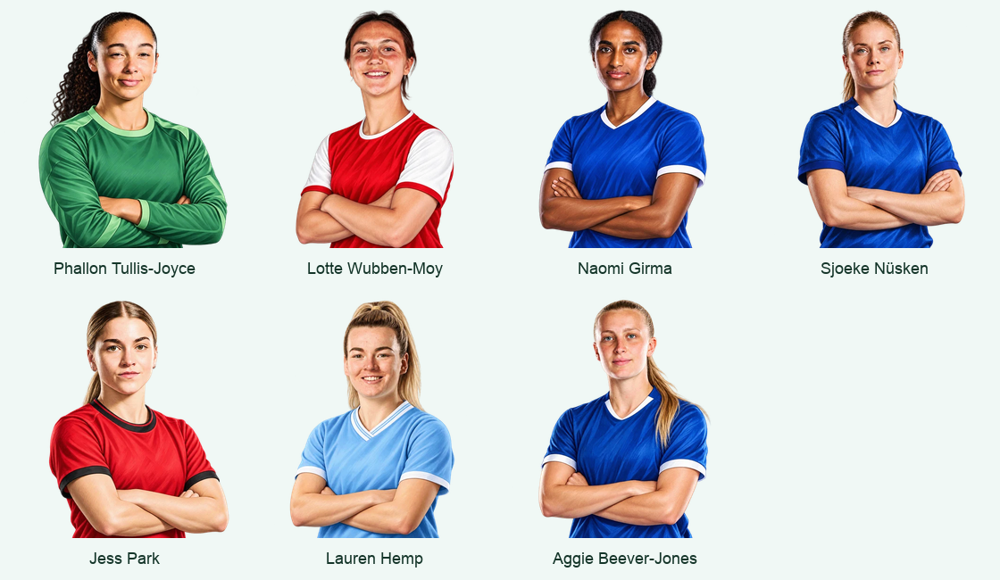

# Expanded football squad

The squad now has 18 unique players: the original starting eleven plus Phallon
Tullis-Joyce, Lotte Wubben-Moy, Naomi Girma, Sjoeke Nüsken, Jess Park, Lauren Hemp
and Aggie Beever-Jones. Each player has a distinct price from 10 to 95 coins, with
the transfer market ordered from cheapest to most expensive. Players train through Academy,
Bronze, Silver, Gold and Legend. The collection and transfer market both have room
for all 18. Existing player ids, coins and earned badges survive the expansion.

The new club and position information was checked against the clubs' own pages:
[Manchester United's goalkeeper](https://www.manutd.com/en/teams/womens-team/phallon-tullis-joyce),
[Jess Park](https://www.manutd.com/en/teams/womens-team/jess-park),
[Lotte Wubben-Moy](https://www.arsenal.com/women/players/lotte-wubben-moy),
[Chelsea's squad](https://www.chelseafc.com/en/teams/womens-profiles), and
[Lauren Hemp](https://www.mancity.com/news/womens/lauren-hemp-200-man-city-appearances-63924294).
The original eleven retain the branch's existing club information.

## Artwork

Each final portrait was a separate request to the built-in image generator on
26 September 2026. The [prompt manifest](football-art-prompts.json) records the
exact final prompts and earlier Google prompts. These are generated illustrations,
not official club artwork. Shirts have plain club colours without logos or sponsors;
player names, clubs, positions and card tiers remain live text.

Google Nano Banana 2 returned `IMAGE_OTHER` without an image for Phallon
Tullis-Joyce (including one unchanged retry) and Lotte Wubben-Moy. The built-in tool
then produced the portraits. Initial drafts did not consistently preserve individual likenesses; each final
portrait therefore uses that player’s public club photo as an identity reference. Those reference photos remain in ignored local
working files and are not shipped with the app.

The final images have real alpha transparency. Originals remain in the generator's
output folder, with working copies under ignored `output/football-art/`. Transparent
512 × 512 WebP files at quality 88 are bundled under `public/art/rewards/football/`.
No image requests or API keys are used by the running app.

For an optional Google retry, `npm run art:football -- --dry-run` lists the individual
requests. `--only` selects player ids. The script uses the saved Google prompts,
not the built-in prompts, and follows the key setup in [Nano Banana setup](nano-banana-2.md).
It stops on an error and never retries automatically. A Google image would need
inspection and local background removal with `scripts/prepare-pokemon.py --theme football`
before replacing a final asset.

## Validation

The production build and 186 unit tests pass. All 14 browser scenarios have
passed, including migrating an eleven-player v3 save, buying the seven additions,
retaining its earned badge, and completing the fresh-practice / delayed-review
flow across a reload. The local Google integration's nine mocked checks also pass.

All 18 cards and their shop portraits render at desktop and 375px widths without
horizontal overflow or browser errors. The seven additions have real transparency,
were inspected on light and dark backgrounds, and total 349 KB. The complete
reward set contains 120 local WebP assets totalling 4.43 MB.
