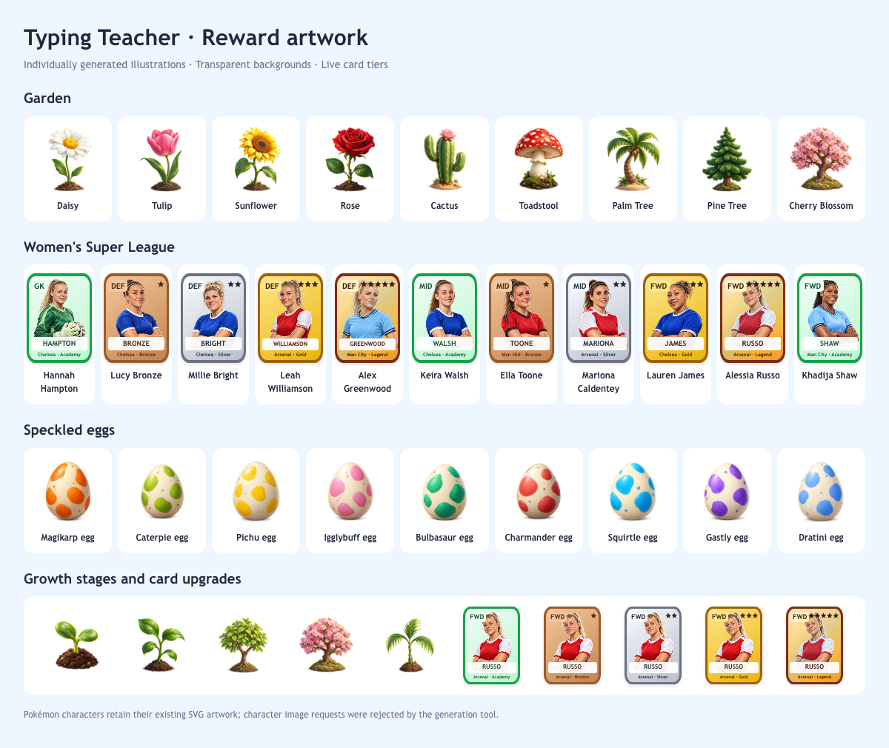
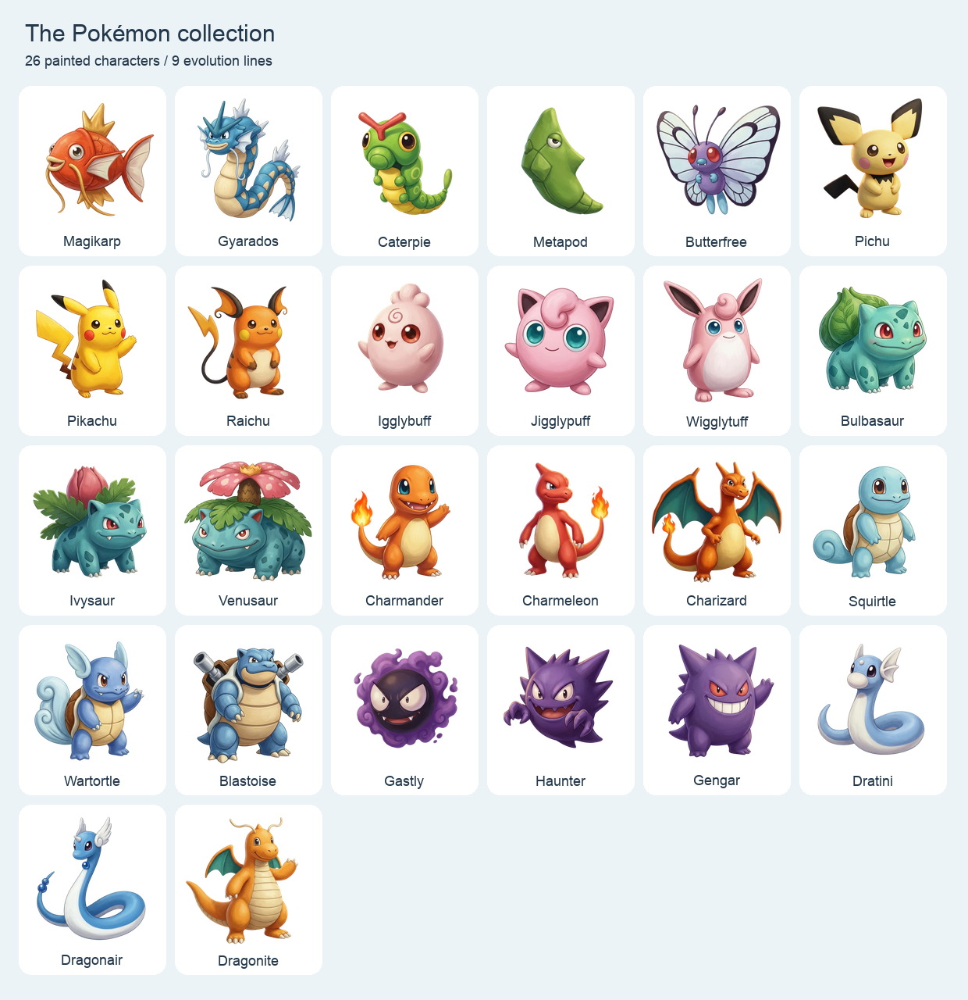

# Reward artwork

Generated individually on 24–26 September 2026, using the built-in image generation
tool for plants, eggs and player portraits, and Google's Nano Banana 2 for Pokémon and animals.
The original emoji and SVG subjects informed the prompts. The supplied Pikachu
provided the style reference for the other characters. All finished artwork
is bundled locally as transparent 512 × 512 WebP images in `public/art/rewards/`.
WebP conversion preserves alpha and uses quality 88; no runtime image service is needed.

## Asset set

- `garden/`: 13 illustrations covering all existing growth-stage ids, including
  shared seedlings and leaves, young trees, and each mature plant.
- `football/`: 18 individual illustrated player portraits. Each is reused across
  its five tiers; names, positions, club names, stars and upgrade frames are live
  HTML/CSS so they remain accurate and don't depend on generated lettering.
- `eggs/`: 9 individually generated ivory eggs with each evolution line's existing
  speckle colour.
- `pokemon/`: all 26 character forms across the nine evolution lines. Twenty-five
  were generated individually with Nano Banana 2; Pikachu uses the supplied image.
- `animals/`: 54 bird, mammal and other animal illustrations: baby, juvenile
  and adult artwork for each of 18 species, each requested separately. See the
  [animal artwork and regeneration guide](animal-art.md).

Seven additional portraits fill the expanded squad; see the [football artwork guide](football-art.md).

The portraits are generated illustrations, not official photographs. Clothing
uses the colours already defined by this branch's catalogue.

## Character artwork

All character stages now use the generated illustrations. Original character
SVGs remain in the source tree as references; only the generic fallback egg is
used for an unrecognised saved item. No identities or progression rules changed.

Nano Banana 2 generated white-background originals. Local background removal
with the BiRefNet-General and General-Lite models and colour decontamination
produced transparent PNG cutouts, then 512px WebP assets. This also removed the checkerboard baked into
the supplied Pikachu. Charizard received one additional image-edit request to
remove a duplicated tail before background removal.

## Prompts and maintenance

To regenerate the Pokémon using your Google API key, follow the
[Nano Banana 2 setup](nano-banana-2.md). The local script sends the 25 saved
character prompts individually and can reuse the supplied Pikachu as a style
reference. Generated originals are kept separately until reviewed and prepared
as transparent assets.

The exact individual prompts, including the two rejected requests, are recorded
in [reward-art-prompts.json](reward-art-prompts.json). Each entry's `id` maps to
`public/art/rewards/<id>.webp`, except the two rejected `pokemon/` entries.
The final Pokémon prompt set is in
[pokemon-character-prompts.json](pokemon-character-prompts.json), and the
[generation record](pokemon-generation.json) includes the accepted output
settings and Charizard's correction prompt. The earlier rejections were from
the built-in tool; the subsequent Google requests produced all 25 characters.

`src/art/assets.ts` maps the original garden stage identifiers to image names.
Keeping those identifiers preserves saved progress and growth sequences. Egg
and portrait filenames match their existing kind ids.

To replace an illustration, generate that asset individually using its prompt,
inspect the output, and encode it as a transparent WebP at the same path. Keep
the whole subject visible for plants and eggs. Verify the picker, collection,
shop and lesson results at narrow and desktop widths.

## Original artwork verification (24 September)

- Production build, 147 unit tests, 8 browser smoke tests and 8 generator checks passed.
- All 59 images are 512 × 512 with transparent background pixels and
  visible subjects; the full image set is approximately 2.4 MB (the Pokémon are 0.83 MB).
- All 26 character forms loaded in the app at desktop and 375px widths:
  no missing images, page errors or horizontal overflow. Cutouts were inspected
  on both light and dark backgrounds.
- Garden, squad and egg collections were checked at desktop and 375px widths:
  no broken images or horizontal overflow. Card proportions remain 64:88.

## Animal mode verification (26 September)

- Production build, 170 unit tests, 12 browser tests and 9 generator checks passed.
- All 54 animal growth-stage images are transparent 512 × 512 WebP files,
  totalling 1.67 MB. The complete reward set now has 113 images, totalling 4.08 MB.
- All growth stages rendered in the app without missing images or page errors.
  Desktop and 375px layouts had no horizontal overflow. Every cutout was
  checked on light and dark backgrounds; all silhouettes stay inside the frame.
- Browser tests cover baby-to-juvenile artwork and size changes, reloads,
  category filters, and purchases beyond 18 and 24 in all expanding themes.
- The production files contain no configured Google API key; generation inputs
  and credentials remain outside the tracked app assets.

## Football expansion and practice verification (26 September)

- Seven new individual illustrated portraits expand the football squad to 18.
  Each uses a public club photo as an identity reference; originals and source
  photos stay in ignored working files. See [football artwork](football-art.md),
  [exact prompts](football-art-prompts.json) and [asset record](football-art-generation.json).
- The 120 bundled reward images total 4.43 MB. New portraits total 349 KB,
  preserve real alpha transparency, and were checked on light and dark backgrounds.
- Production build, 186 unit tests, all 14 browser scenarios and 9 mocked generator
  checks pass. Browser coverage includes old-save migration, buying the seven
  additions, delayed practice reviews after a reload, and the phone-sized keyboard.
- Thirty difficult rounds at each of the 12 levels remain complete, varied and
  typeable, including short-word trails when the early word bank is exhausted.
  Mastery thresholds and earned rewards remain intact.
